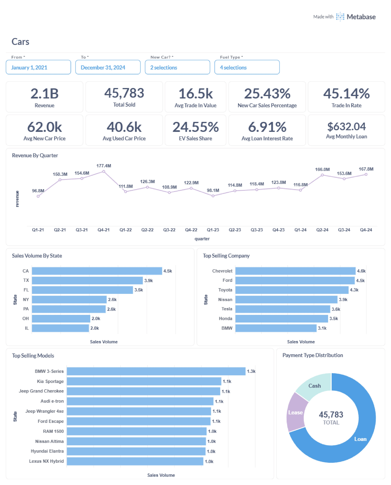
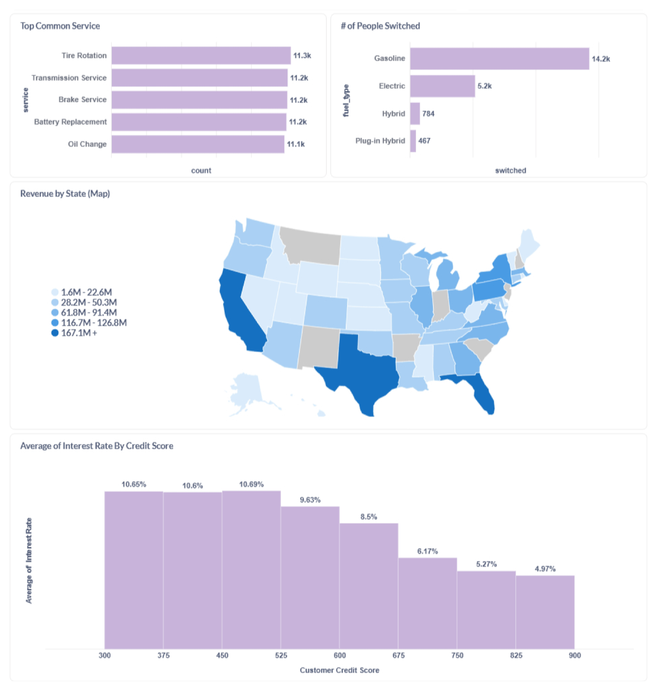
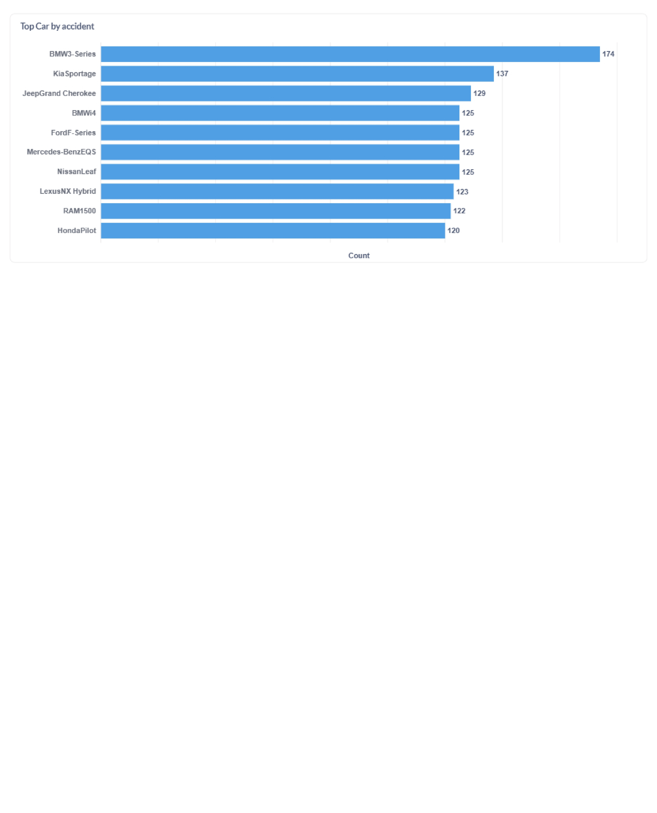

# Cars Data Analysis Dashboard

This project presents an analysis of car sales, service, and customer trends using data visualizations created in Metabase. The dataset is hosted on Supabase, and the dashboard provides insights into sales revenue, loan interest rates, accident statistics, service trends, and more.

## Key Stats & Insights
> There are some filters you can play with to find insights from the data.

- **Total Revenue:** $2.1B (2021–2024)
- **Total Sales Volume:** 45,783 cars
- **Average Trade-In Value:** $16.5k
- **New Car Sales Percentage:** 25.43%
- **Trade-In Rate:** 45.14%
- **Average New Car Sale Price:** $62.0k
- **Average Used Car Sale Price:** $40.6k
- **EV Sales Share:** 24.55%
- **Average Loan Interest Rate:** 6.91%
- **Average Monthly Loan Payment:** $632.04

### Top Performers

- **Top Selling State:** California (CA) with $227.3M in sales revenue and 4.5k sales volume
- **Top Selling Company:** Chevrolet (4.6k sales), followed by Ford (4.5k) and Toyota (4.3k)
- **Top Selling Model:** BMW 3-Series (1.3k sales)
- **Top Car by Accident Count:** BMW 3-Series (89 accidents)

### Service & Customer Trends

- **Most Common Services:** Tire Rotation (11.3k), Transmission Service, Brake Service, Battery Replacement, Oil Change (all ~11.1k–11.3k)
- **Customer Switch Trends:** Most customers with trade-ins switched to Gasoline (12.2k), followed by Electric (4.9k), Hybrid (777), and Plug-in Hybrid (465)

### Payment Types

- **Loan:** Majority of payments
- **Lease & Cash:** Smaller shares

## Data Source

- **Database:** Supabase (PostgreSQL)
- **Tables analyzed:** Car sales, service records, customer trade-ins, loan information, etc.

## Analysis & Visualizations

The analysis covers:

- **Sales Revenue by State**
- **Average Loan Interest Rate by Credit Score**
- **Top Cars by Accident Count**
- **Most Common Service Types**
- **Customer Switch Trends**
- **Quarterly Revenue Trends**
- **Top Selling Companies and Models**
- **Payment Type Distribution**

## Tools Used

- [Metabase](https://www.metabase.com/) for data visualization and dashboarding.
- [Supabase](https://supabase.com/) for cloud-hosted PostgreSQL database.

## Screenshots

See the `images` folder for all dashboard screenshots:

## Author

- **Shawon Mandal**  
  [LinkedIn Profile](https://www.linkedin.com/in/shawon-mandal-160440260/)

