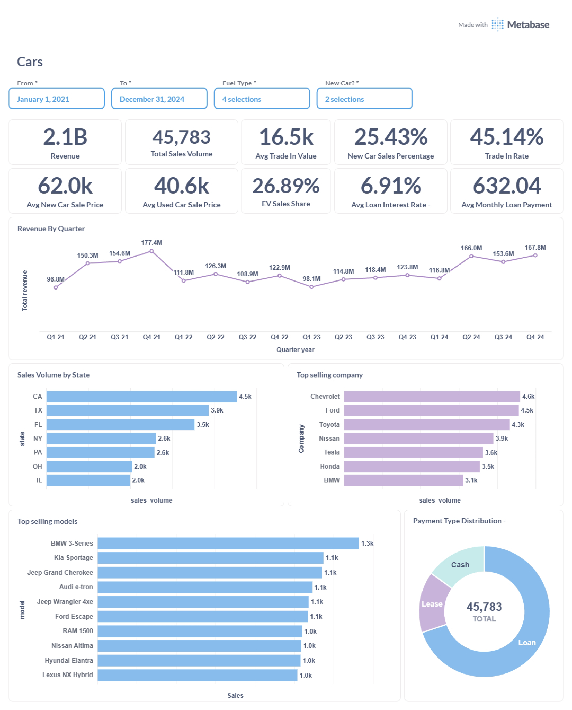
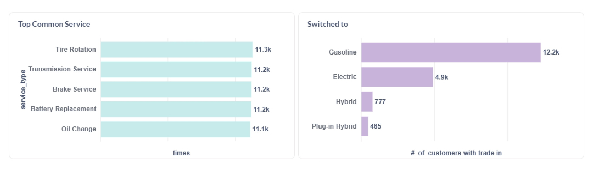
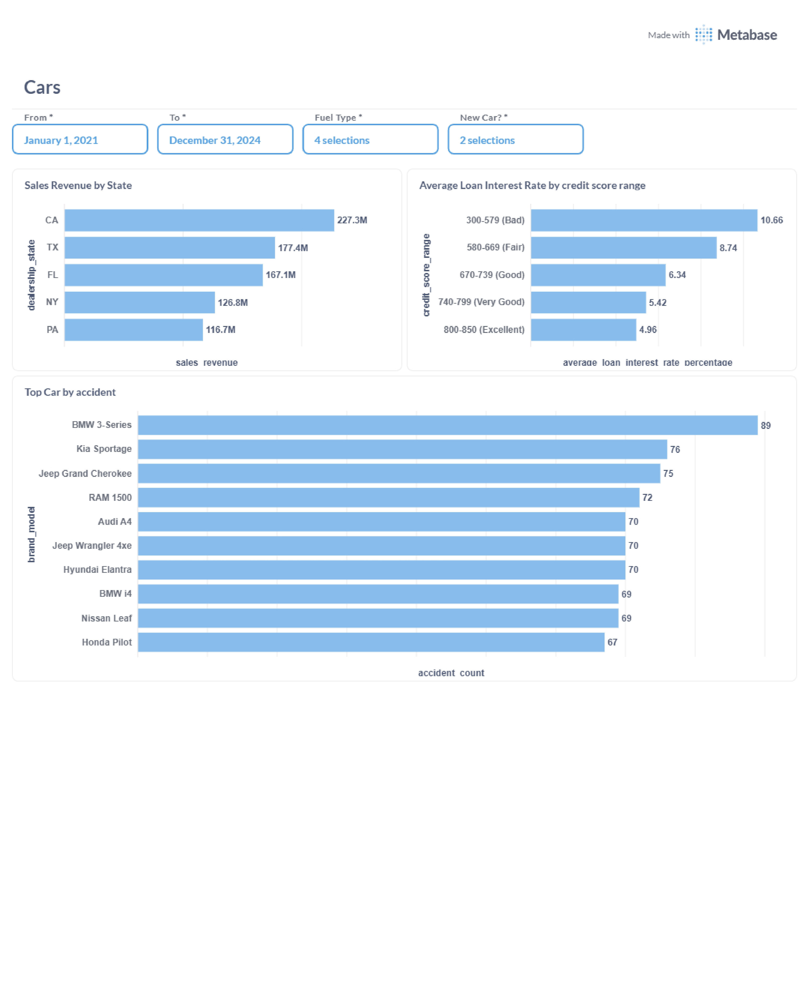

# Cars Data Analysis Dashboard

This project presents an analysis of car sales, service, and customer trends using data visualizations created in Metabase. The dataset is hosted on Supabase, and the dashboard provides insights into sales revenue, loan interest rates, accident statistics, service trends, and more.


## Data Source

- **Database**: Supabase (PostgreSQL)
- **Tables analyzed**: Car sales, service records, customer trade-ins, loan information, etc.

## Analysis & Visualizations

The analysis covers:

- **Sales Revenue by State**
- **Average Loan Interest Rate by Credit Score**
- **Top Cars by Accident Count**
- **Most Common Service Types**
- **Customer Switch Trends**
- **Quarterly Revenue Trends**
- **Top Selling Companies and Models**
- **Payment Type Distribution**

Sample dashboards and charts are available in the `images` folder.

## How to Use

1. **Clone this repository**:
   ```bash
   git clone https://github.com/yourusername/cars-data-analysis.git
   ```
2. **View Dashboards**: Open the images in the `images` folder to explore the analysis.
3. **Data Source**: Connect to the Supabase database if you wish to reproduce or extend the analysis in Metabase.

## Tools Used

- [Metabase](https://www.metabase.com/) for data visualization and dashboarding.
- [Supabase](https://supabase.com/) for cloud-hosted PostgreSQL database.

## Screenshots

See the `images` folder for all dashboard screenshots:






